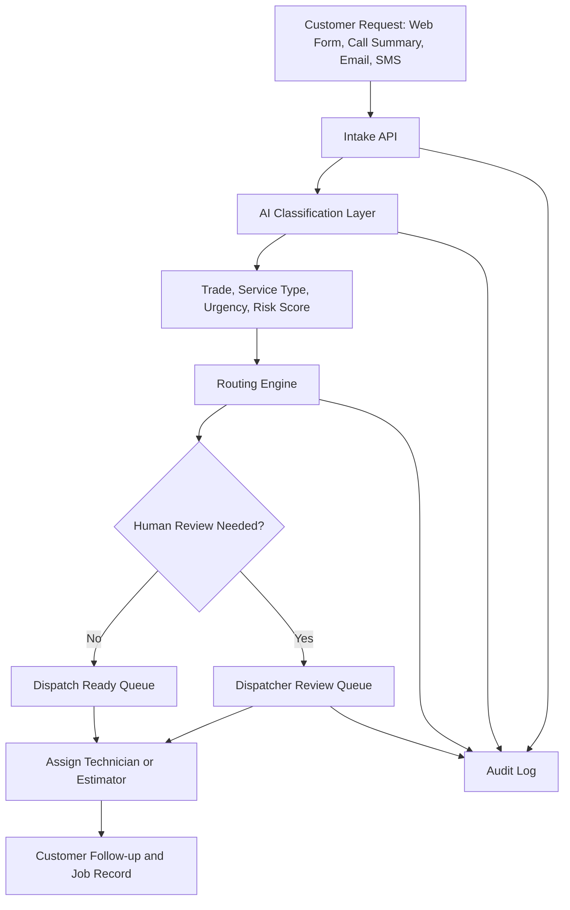

# AI-Powered Trades Service Request Triage System

A cloud-ready reference architecture for AI-assisted intake, classification, priority scoring, and dispatch routing for **electricians, plumbers, and roofers**.

This project demonstrates how a trades company can reduce missed opportunities, speed up response times, and improve job routing while keeping a human dispatcher or operations manager in control.

## Business Problem

Trade businesses often receive requests from phone calls, web forms, emails, text messages, and emergency after-hours channels. These requests can be messy, incomplete, and hard to prioritize quickly.

Common challenges include:

- Emergency requests getting mixed in with routine inquiries
- Manual sorting by trade, service type, urgency, and location
- Missed high-value quote requests
- Poor documentation before dispatch
- Technicians receiving incomplete job details
- No consistent audit trail for intake and routing decisions

This project shows a practical architecture for handling those requests using AI-assisted classification, rules-based routing, human review, and dispatch-ready records.

## Target Users

This reference architecture is designed for small and mid-sized trade companies, including:

- Electrical contractors
- Plumbing companies
- Roofing companies
- Multi-trade service businesses
- After-hours answering and dispatch teams
- Operations managers who need better intake visibility

## Example Use Cases

### Electrical

- Power outage in part of a home
- Breaker repeatedly tripping
- EV charger installation request
- Panel upgrade quote
- Lighting retrofit inquiry
- Emergency safety concern

### Plumbing

- Burst pipe
- No hot water
- Drain backup
- Leak under sink
- Sump pump failure
- Bathroom renovation quote

### Roofing

- Active roof leak
- Missing shingles after wind
- Ice dam concern
- Roof inspection request
- Eavestrough repair
- Full roof replacement quote

## What This Project Demonstrates

This repo is intentionally built to show solution architecture skills, not just application coding.

It demonstrates:

- Business process analysis
- Domain-specific intake design
- AI-assisted classification
- Rules-based routing
- Risk and urgency scoring
- Human-in-the-loop review
- Audit logging
- Data model design
- Security and privacy awareness
- Cloud-ready deployment structure
- Documentation through architecture decision records

## High-Level Architecture



## Core Workflow

1. A customer submits a service request.
2. The intake API stores the request.
3. The AI layer classifies the trade, service category, urgency, and safety risk.
4. The routing engine recommends a queue.
5. Emergency and uncertain requests are flagged for human review.
6. A dispatcher confirms routing and technician assignment.
7. All decisions are captured in the audit log.

## Example Classification Output

```json
{
  "trade": "plumbing",
  "service_type": "burst_pipe",
  "urgency": "emergency",
  "risk_score": 95,
  "recommended_queue": "after_hours_emergency_dispatch",
  "human_review_required": true,
  "reason": "Customer reports active water leak and property damage risk."
}
```

## Repository Structure

```text
trades-request-ai-triage/
├── README.md
├── docs/
│   ├── architecture-overview.md
│   ├── data-model.md
│   ├── security-and-privacy.md
│   ├── deployment-notes.md
│   └── adr/
│       ├── ADR-001-domain-specific-triage.md
│       ├── ADR-002-human-in-the-loop-dispatch.md
│       ├── ADR-003-audit-logging.md
│       └── ADR-004-cloud-ready-configuration.md
├── apps/
│   ├── api/
│   │   ├── package.json
│   │   ├── .env.example
│   │   └── src/
│   │       ├── index.js
│   │       ├── classifier.js
│   │       ├── router.js
│   │       └── audit.js
│   └── web/
│       ├── package.json
│       ├── index.html
│       └── src/
│           ├── App.jsx
│           └── sampleRequests.js
├── database/
│   └── schema.sql
├── workflows/
│   └── routing-logic.md
├── .github/
│   └── workflows/
│       └── ci.yml
└── .gitignore
```

## Suggested Tech Stack

The sample implementation uses a lightweight JavaScript stack:

- React/Vite for the demo dashboard
- Express for the mock API
- PostgreSQL/Supabase-compatible schema
- Mermaid for architecture diagrams
- GitHub Actions for basic CI checks

The architecture can also be adapted to Azure, AWS, or a no-code/low-code stack.

## Local Development

### API

```bash
cd apps/api
npm install
npm run dev
```

The API runs on:

```text
http://localhost:4000
```

### Web App

```bash
cd apps/web
npm install
npm run dev
```

The web app runs on:

```text
http://localhost:5173
```

## API Endpoints

### Health Check

```http
GET /health
```

### Create Request

```http
POST /requests
Content-Type: application/json

{
  "customerName": "Sam Taylor",
  "phone": "555-555-0100",
  "address": "123 Main Street",
  "message": "Water is leaking from the ceiling under the upstairs bathroom.",
  "preferredTrade": "plumbing"
}
```

### List Requests

```http
GET /requests
```
