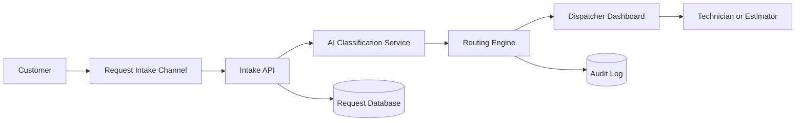
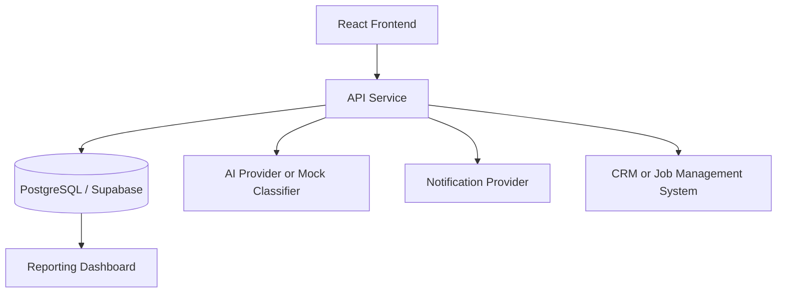

# Architecture Overview

## Purpose

This solution demonstrates an AI-assisted intake and dispatch architecture for trade service businesses. It is designed for electricians, plumbers, roofers, and multi-trade service companies that need to triage requests quickly and consistently.

## Architectural Goals

The architecture is designed to:

- Capture requests from customers in a structured way
- Classify each request by trade, service type, urgency, and risk
- Route work to the correct operational queue
- Keep human dispatchers in control of high-risk or uncertain decisions
- Maintain an audit trail of classification and routing decisions
- Support future cloud deployment and CRM integration

## Context Diagram

## Key Components

### 1. Request Intake

Accepts customer requests from a web form, call summary, SMS transcript, email, or chatbot. The minimum viable request includes customer contact information, location, message, and optional preferred trade.

### 2. AI Classification Layer

Classifies the request into a trade category and service type. In this starter project, the classifier is rule-based to keep the demo easy to run. In production, this could be replaced with OpenAI, Azure OpenAI, or another LLM service.

The classifier returns:

- Trade
- Service type
- Urgency
- Risk score
- Confidence
- Classification reason

### 3. Routing Engine

The routing engine applies business rules to determine where the request should go. Examples:

- Active leaks go to emergency plumbing dispatch
- Electrical safety risks go to urgent electrical review
- Roof leaks after storms go to roofing emergency queue
- Quote requests go to estimator follow-up
- Low-confidence results go to dispatcher review

### 4. Human Review Queue

Human review is required when:

- The request is high-risk
- The model confidence is low
- The customer describes a possible safety issue
- The request contains ambiguous or incomplete information
- The job may require after-hours dispatch

### 5. Audit Logging

Audit logs record important actions, including intake, classification, routing, review, and assignment. This supports accountability, troubleshooting, and operational reporting.

## Deployment View

## Non-Functional Requirements

### Security

- Environment variables for secrets
- No API keys committed to source control
- Role-based access for dispatch/admin users
- HTTPS for all production traffic
- Input validation on request submissions

### Privacy

- Collect only the data needed to respond to the request
- Avoid collecting unnecessary sensitive information
- Protect customer addresses and contact information
- Define retention rules for requests and audit logs

### Reliability

- Emergency classifications should fail safe into human review
- Requests should be stored before downstream routing
- Routing should be explainable and auditable

### Scalability

This starter project is small, but the architecture can scale by separating intake, classification, routing, notification, and reporting into independent services.

## Why This Is a Solution Architecture Project

This project demonstrates more than a working app. It shows how to map a real business problem into a structured solution with:

- Components
- Workflows
- Data boundaries
- Risk controls
- Decision records
- Deployment considerations
- Operational governance
