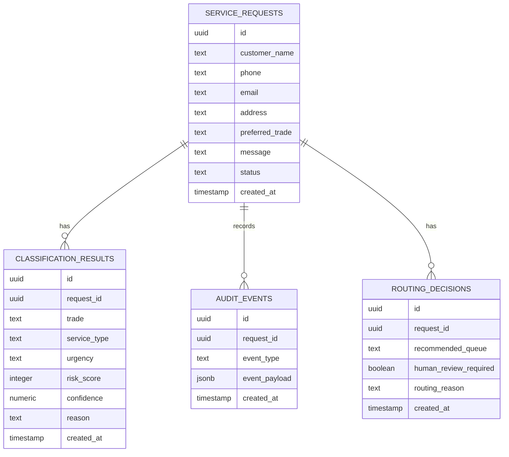

# Data Model

## Overview

The data model supports intake, classification, routing, review, and audit logging for trade service requests.

## Main Entities

## service_requests

Stores the original customer-submitted request.

Important fields:

- `customer_name`: Name supplied by the requester
- `phone`: Primary contact number
- `email`: Optional email address
- `address`: Service location
- `preferred_trade`: Optional selected trade, such as electrical, plumbing, or roofing
- `message`: Unstructured customer description
- `status`: Current workflow status

Recommended statuses:

- `new`
- `classified`
- `review_required`
- `dispatch_ready`
- `assigned`
- `closed`

## classification_results

Stores the output of the AI or mock classifier.

Important fields:

- `trade`: electrical, plumbing, roofing, or general
- `service_type`: category such as burst_pipe, panel_upgrade, roof_leak
- `urgency`: routine, priority, urgent, or emergency
- `risk_score`: numeric score from 0 to 100
- `confidence`: confidence score from 0 to 1
- `reason`: plain-language explanation

## routing_decisions

Stores the recommended operational queue.

Example queues:

- `electrical_emergency_dispatch`
- `plumbing_emergency_dispatch`
- `roofing_leak_response`
- `estimator_follow_up`
- `dispatcher_review`
- `routine_service_queue`

## audit_events

Stores key workflow events.

Example event types:

- `request_created`
- `request_classified`
- `routing_decision_created`
- `human_review_required`
- `technician_assigned`
- `request_closed`

## Design Rationale

The model separates the original request from classification and routing decisions. This makes the system easier to audit, test, and improve.

For example, if classification logic changes later, the original customer request remains unchanged while new classification records can be created and compared.